### Week 1

* [x] Create a git repository (M5)  
* [x] Make sure that all team members have write access to the GitHub repository (M5)  
* [x] Create a dedicated environment for you project to keep track of your packages (M2)  
* [x] Create the initial file structure using cookiecutter with an appropriate template (M6)  
* [x] Fill out the \`data.py\` file such that it downloads whatever data you need and preprocesses it (if necessary) (M6)  
* [x] Add a model to \`model.py\` and a training procedure to \`train.py\` and get that running (M6)  
* [x] Remember to either fill out the \`requirements.txt\`/\`requirements\_dev.txt\` files or keeping your  
   \`pyproject.toml\`/\`uv.lock\` up-to-date with whatever dependencies that you are using (M2+M6)  
* [x] Remember to comply with good coding practices (\`pep8\`) while doing the project (M7)  
* [x] Do a bit of code typing and remember to document essential parts of your code (M7)  
* [x] Setup version control for your data or part of your data (M8)  
* [x] Add command line interfaces and project commands to your code where it makes sense (M9)  
* [x] Construct one or multiple docker files for your code (M10)  
* [x] Build the docker files locally and make sure they work as intended (M10)  
* [x] Write one or multiple configurations files for your experiments (M11)  
* [x] Used Hydra to load the configurations and manage your hyperparameters (M11)  
* [x] Use profiling to optimize your code (M12)  
* [x] Use logging to log important events in your code (M14)  
* [x] Use Weights & Biases to log training progress and other important metrics/artifacts in your code (M14)  
* [x] Consider running a hyperparameter optimization sweep (M14)  
* [x] Use PyTorch-lightning (if applicable) to reduce the amount of boilerplate in your code (M15)

### Week 2

* [x] Write unit tests related to the data part of your code (M16)  
* [x] Write unit tests related to model construction and or model training (M16)  
* [x] Calculate the code coverage (M16)  
* [x] Get some continuous integration running on the GitHub repository (M17)  
* [x] Add caching and multi-os/python/pytorch testing to your continuous integration (M17)  
* [x] Add a linting step to your continuous integration (M17)  
* [x] Add pre-commit hooks to your version control setup (M18)  
* [x] Add a continues workflow that triggers when data changes (M19)  
* [x] Add a continues workflow that triggers when changes to the model registry is made (M19)  
* [x] Create a data storage in GCP Bucket for your data and link this with your data version control setup (M21)  
* [x] Create a trigger workflow for automatically building your docker images (M21)  
* [x] Get your model training in GCP using either the Engine or Vertex AI (M21)  
* [x] Create a FastAPI application that can do inference using your model (M22)  
* [x] Deploy your model in GCP using either Functions or Run as the backend (M23)  
* [x] Write API tests for your application and setup continues integration for these (M24)  
* [x] Load test your application (M24)  
* [ ] Create a more specialized ML-deployment API using either ONNX or BentoML, or both (M25)  
* [x] Create a frontend for your API (M26)

### Week 3

* [x] Check how robust your model is towards data drifting (M27)  
* [x] Setup collection of input-output data from your deployed application (M27)  
* [x] Deploy to the cloud a drift detection API (M27)  
* [ ] Instrument your API with a couple of system metrics (M28)  
* [ ] Setup cloud monitoring of your instrumented application (M28)  
* [ ] Create one or more alert systems in GCP to alert you if your app is not behaving correctly (M28)  
* [x] If applicable, optimize the performance of your data loading using distributed data loading (M29)  
* [ ] If applicable, optimize the performance of your training pipeline by using distributed training (M30)  
* [ ] Play around with quantization, compilation and pruning for you trained models to increase inference speed (M31)

### Extra

* [ ] Write some documentation for your application (M32)  
* [ ] Publish the documentation to GitHub Pages (M32)  
* [x] Revisit your initial project description. Did the project turn out as you wanted?  
* [x] Create an architectural diagram over your MLOps pipeline  
* [x] Make sure all group members have an understanding about all parts of the project  
* [x] Uploaded all your code to GitHub

**Group information**

**Question 1**  
Enter the group number you signed up on \<learn.inside.dtu.dk\>**

4

**Question 2**  
Enter the study number for each member in the group

S194077, S194408, S242656, S250806

**Question 3**  
**Did you end up using any open-source frameworks/packages not covered in the course during your project? If so which did you use and how did they help you complete the project?**

Recommended answer length: 0-200 words.

Example:
*We used the third-party framework ... in our project. We used functionality ... and functionality ... from the package to do ... and ... in our project*.

We have not currently used any open-source frameworks/packages not covered in the course during our project.

**Coding environment**

In the following section we are interested in learning more about your local development environment. This includes how you managed dependencies, the structure of your code and how you managed code quality.

**Question 4**

**Explain how you managed dependencies in your project? Explain the process a new team member would have to go through to get an exact copy of your environment.**

Recommended answer length: 100-200 words

Answer:

We used uv for managing our dependencies. The list of dependencies was auto-generated using uv, by adding packages using uv add (and, where needed, pinning specific versions). We had a development dependency in which development tools such as ruff and pytest were kept. uv records the desired dependencies in pyproject.toml and resolves them into a lockfile (uv.lock) to ensure reproducible installs across machines.

We also pinned the python version in a .python-version file. 

To reproduce the environment, a new member should install uv, clone the repository and sync the locked environment using, if they want full development tooling uv sync \--locked — group dev. This will install the exact same locked version, (which will have no conflicts due to uv graph handling of packages) of the packages needed in the project. 

**Question 5**

**We expect that you initialized your project using the cookiecutter template. Explain the overall structure of your code. What did you fill out? Did you deviate from the template in some way?**

Recommended answer length: 100-200 words

Answer:

We initialized the repository from the course cookiecutter template and kept the main layout. The main important deviation is that the Python package lives in `src/group04/` rather than the default `src/project_name/`. This was initially not deliberate, but we decided to stick with it. Within this package we implemented the core pipeline components (data loading/preprocessing, model definition, training/evaluation, and the API/inference entry points).

We also extended the template with some additional directories. The `data/` folder contains both `raw/` and `processed/` datasets, organized by class labels (e.g., AF/NSR/Noise) and by modality (`time_series/` and `images/`). We added a `frontend/` directory for a Streamlit UI, we added a data drift code in a directory `drift/` . During experimentation, PyTorch Lightning produced `lightning_logs/`, and we store trained weights in `checkpoints/`. We added `tests/performancetests/` to separate performance-related tests from unit tests.

**Question 6**

**Did you implement any rules for code quality and format? What about typing and documentation? Additionally, explain with your own words why these concepts matters in larger projects.**

Recommended answer length: 100-200 words.

Answer:

We did not include any specific rule for code quality and format. Although we did use use ruff for linting. 

In general we tried to stay to the PEP8 guidelines for code quality and format, although this wasn’t officially discussed. 

The goal of our code was to be human readable and require as few comments as possible. We have not implemented special exact rules or protocols for typing and documentation. We found that as we used tools like co-pilot during the project, often both documentation and typing were taken care of, therefore we focused more on writing clear code, and avoided hard and fast rules.

In a larger organisation, stricter rules are often necessary, here our code base was relatively small, and we could ask each other if something was unclear. In larger organisations, it is important that completely disconnected teams can understand and use each other's code,(for example through standard documentation), and it is important that if they make a mistake it doesn’t break everything (for example with strict typing). 

**Version control**

In the following section we are interested in how version control was used in your project during development to corporate and increase the quality of your code.

**Question 7**

**How many tests did you implement and what are they testing in your code?**

Recommended answer length: 50-100 words.

Answer:

We implemented the following tests. 

* Test model, in which we test our model is able to handle different inputs of varying sizes and types.   
* Test api, which tests functionality of our backend.  
* Test data, in which we ensure our data is in correct locations and format and split correctly.  
* Test Drift Detection, in which various functions needed for the data drift monitoring are tested.  
* Test Training where we test a training step.  
* Load test, in which we test the ability of our application to handle multiple concurrent users.

These cover the most critical aspects of our application, that our model is not totally broken, that our api still functions as expected, and that it can handle multiple users.

**Question 8**

**What is the total code coverage (in percentage) of your code? If your code had a code coverage of 100% (or close to), would you still trust it to be error free? Explain you reasoning.**

Recommended answer length: 100-200 words.

Example:  
**The total code coverage of code is X%, which includes all our source code. We are far from 100% coverage of our code and even if we were then...**

Answer:

\--- question 8 fill here —

The total test code coverage is 43%. This is much less than 100%. The coverage of the data file is especially poor, and the coverage of our model is also poor. 

However, even if the coverage was 100% this would be no guarantee of an error free codebase. Firstly, tests only catch what you test for, and although code coverage may be 100%, and some lines may be covered, if the test is incorrect, or somewhat limited, i.e. doesn’t catch all errors possible from this part of the code, it is not a guarantee that it is error free.

In general testing allows you to catch errors you foresee, but cannot help you catch errors you do not foresee. If we can think of a problem, we can write a test for it and make sure our code can handle it, but it doesn't help with situations that we don’t anticipate, as such it is not a guarantee our code is working. It is better than nothing, although it shouldn’t lure you into a false sense of security.

**Question 9**

**Did you workflow include using branches and pull requests? If yes, explain how. If not, explain how branches and pull request can help improve version control.**

Recommended answer length: 100-200 words.

Answer:

We made use of both multiple branches and pull requests in our project. We began with each team member assigned to a branch, however after the first day of development we consolidated this into a main branch, using pull requests and manual editing. We then decided rather than focusing on each team member using a branch to instead create branches for specific features. This worked well however sometimes caused merge conflicts and also occasionally the scope of a branch would grow too large.

We had issues with automatic branch creation when errors arose, however we soon dealt with this. We strived as the project progressed to not have too many branches, as we didn’t want to struggle with complicated merges, so often merged small branches into main and then deleted the branch. 

Once or twice when large merge conflicts arose we worked through as a team to manually copy paste code.

**Question 10**

**Did you use DVC for managing data in your project? If yes, then how did it improve your project to have version control of your data. If no, explain a case where it would be beneficial to have version control of your data.**

Recommended answer length: 100-200 words.

Answer:

Yes, we used DVC for data version control. We tracked our ECG dataset (time-series stored as `.npy` files under `data/raw`/`data/processed`) using DVC, while keeping only lightweight `.dvc` metadata and the DVC lockfile in Git. The actual data is stored in a remote Google Cloud Storage bucket, so team members can reproduce the exact dataset version for a given Git commit via `dvc pull`, and new/updated datasets can be shared consistently via `dvc push`. 

In all honesty, this was not really necessary for our project. Our dataset is very small and we all had a local identical copy, as we did not make any modifications / improvements to our dataset except changing from numpy arrays to pytorch tensors, and as such did not need version control. 

However, using DVC means that it is very convenient for a new team member if they joined, as they can easily access the exact data we used, and if we ever do change the data, the change will be recorded. 

**Question 11**

**Discuss your continuous integration setup. What kind of continuous integration are you running (unittesting, linting, etc.)? Do you test multiple operating systems, Python version etc. Do you make use of caching? Feel free to insert a link to one of your GitHub actions workflow.**

Recommended answer length: 200-300 words.

Example:  
*We have organized our continuous integration into 3 separate files: one for doing ..., one for running ... testing and one for running ... . In particular for our ..., we used ... .An example of a triggered workflow can be seen here: \<weblink\>*

Answer:

We organized our continuous integration into 5 workflow files. The \`tests.yaml\` workflow runs unit tests on every push to main and pull request, testing both Ubuntu and macOS with Python 3.12. We use caching for \`uv\` dependencies through the \`astral-sh/setup-uv@v7\` action, which significantly speeds up CI runs by avoiding redundant package installation.

The \`linting.yaml\` workflow runs \`ruff check\` and \`ruff format\` to ensure code quality standards. The \`data-changes.yaml\` workflow triggers when data files tracked by DVC are modified, automatically re-running the data preprocessing pipeline. The \`model-registry.yaml\` workflow triggers when model checkpoints change, ensuring the model registry is updated. The \`pre-commit-update.yaml\` ensures pre-commit hooks are updated.

Each workflow leverages \`uv\` for fast and reliable dependency management. Our test matrix ensures compatibility across operating systems and Python versions. Caching of dependencies significantly reduces CI execution time. All workflows are stored in \`.github/workflows/\` and are automatically triggered based on conditions.

## Running code and tracking experiments

In the following section we are interested in learning more about the experimental setup for running your code and especially the reproducibility of your experiments.

**Question 12**

**How did you configure experiments? Did you make use of config files? Explain with coding examples of how you would run a experiment.**

Recommended answer length: 50-100 words.

Answer:

We used a combination of argparser and YAML configuration files for experiment configuration. We also have cloud-based configuration stored in config.yaml which specifies the training setup for google cloud vertex AI. The training script then reads these arguments and uses them to configure the data module, model and trainer.

**Question 13**

**Reproducibility of experiments are important. Related to the last question, how did you secure that no information is lost when running experiments and that your experiments are reproducible?**

Recommended answer length: 100-200 words.

Answer:

We ensured experiment reproducibility through (1) fixed configuration, (2) controlled randomness, and (3) automatic logging of outputs and artifacts. Each run is parameterized by CLI arguments and/or a YAML config, so hyperparameters, data paths, and training settings are explicitly captured rather than hard-coded. We also set a global random seed (`seed_everything(seed)`) to reduce nondeterminism in data shuffling and initialization.

During training, PyTorch Lightning logs metrics (e.g., training/validation loss and accuracy) to TensorBoard via `TensorBoardLogger`, creating a versioned run directory under `lightning_logs/`. We save model checkpoints using `ModelCheckpoint` (typically monitoring validation loss), which records the exact model weights corresponding to the best observed validation performance. This means a result can be reproduced by re-running training with the same config and dataset version, or audited by loading the saved checkpoint. When profiling is enabled, the profiler output is also stored as a file artifact, allowing performance comparisons across runs.

**Question 14**

**Upload 1 to 3 screenshots that show the experiments that you have done in W\&B (or another experiment tracking service of your choice). This may include loss graphs, logged images, hyperparameter sweeps etc. You can take inspiration from \[this figure\](figures/wandb.png). Explain what metrics you are tracking and why they are important.**

Recommended answer length: 200-300 words + 1 to 3 screenshots.

Answer:

We conducted a sweep experiment using four sets of hyperparameters, including the learning rate, batch size, number of max epochs, and random seeds. The exact choices of the hyperparameters can be seen in the sweep.yaml file in our repository. We set the number of runs to be 20 and monitored all runs. As seen in image 1, the different combinations of hyperparameters are summarized with respect to the validation loss. The set of hyperparameters that achieves the lowest validation loss includes a batch size of 4, a learning rate of 0.000396, 13 epochs, and a random seed of 2026\. Under this setup, the model was able to achieve a test accuracy of 0.972 and an F1-score of 0.965.

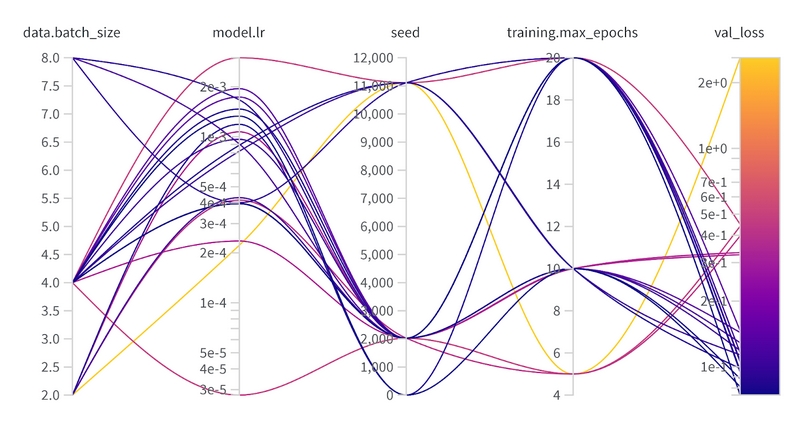  
*Image 1: Validation loss with respect to different hyperparameter sets*

We monitored all 20 runs during the training to ensure that no overfitting appeared. Image 2 shows that there are great fluctuations in the training loss for some runs, indicating a potential overfitting. However, for the chosen model, the training loss is below the validation loss for most of the time (see the thickened lines).

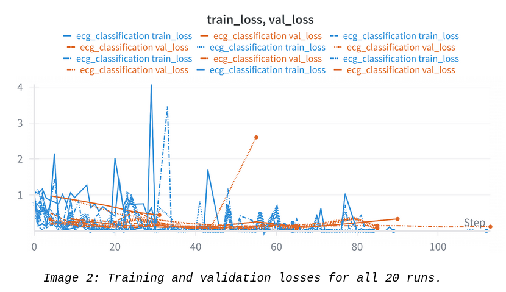      
*Image 2: Training and validation losses for all 20 runs.*

Lastly, the CPU usage is presented in image 3\. The sweep was conducted using a laptop with a 14-core CPU corresponding to 28 threads. For most of the runs, the CPU usage is above 80% after around 40 seconds. The dotted line represents the chosen model.

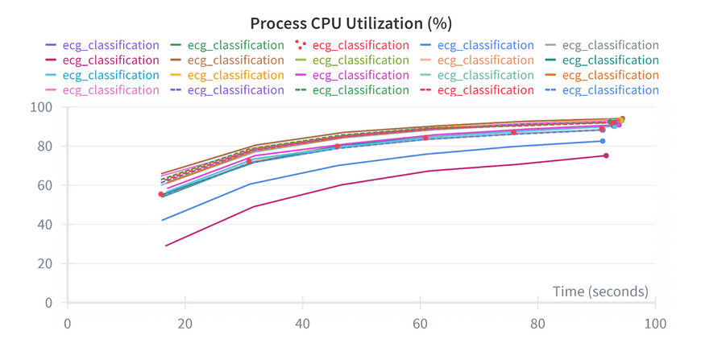 

**Question 15**

**Docker is an important tool for creating containerized applications. Explain how you used docker in your experiments/project? Include how you would run your docker images and include a link to one of your docker files.**

Recommended answer length: 100-200 words.

Answer:

We have developed multiple Docker images for different parts of the MLOps project. The training image train.dockerfile sets up the complete training environment with all dependencies, then pulls data from GCP using DVC, and runs training with some specified hyperparameters. We have also developed a docker image for fastAPI, this image copies the source code from the frontend end folder, and runs the streamlit api. We also developed an api which runs the backend of the application. 

to run the training docker image, one would use the command:   
```bash
docker build -f train.dockerfile -t mlops-train:latest .   
docker run mlops-train:latest --lr 1e-3 --batch_size 64
``` 

**Question 16**

  **When running into bugs while trying to run your experiments, how did you perform debugging? Additionally, did you**  
  **try to profile your code or do you think it is already perfect?**  
   
  Recommended answer length: 100-200 words.  
  Answer:

\--- question 16 fill here \---


When debugging, we primarily used a combination of (1) reproducing failures locally before attempting cloud runs, (2) reading stack traces and adding targeted logging/print statements around data loading and model I/O, and (3) using small “smoke test” runs (1–2 batches, 1 epoch) to isolate whether issues came from.

But in general we didn’t run into too many issues, we trained our model first locally, and made sure we could run all our code locally before we deployed. This reduced the number of bugs we experience. We were also lucky enough to have someone who was very experienced with cloud operations in our group, who was able to help when issues arose. And Copilot was a huge help. **EDIT** this was true until we tried to implement the monitoring API, this took a whole day, building and rebuilding in the cloud, each cycle taking 15 minutes drove us slightly insane.

**Question 17**

  **List all the GCP services that you made use of in your project and shortly explain what each service does?**  
   
  Recommended answer length: 50-200 words.  
  Answer:

We used many GCP services to build our MLOps project. Cloud Storage (Buckets) stored our large ECG dataset and DVC-tracked files, providing data management. Artifact Registry stored our Docker container images (training, API, and inference images) for easy versioning and retrieval. Cloud Build automatically built Docker images whenever code was pushed to the repository. Vertex AI trained our models at scale using our Docker training images on our VM instance (Compute Engine). 

**Question 18**

  **The backbone of GCP is the Compute engine. Explained how you made use of this service and what type of VMs**  
  **you used?**  
   
  Recommended answer length: 100-200 words.  
  Answer:

We used Vertex AI for model training rather than Compute Engine directly, which abstracts away VM management. Our training jobs used   
e2-medium (2 vCPUs, 4 GB Memory) \- the lowest cost instance.

**Question 19**

  **Insert 1-2 images of your GCP bucket, such that we can see what data you have stored in it.**  
    
   
  Answer:

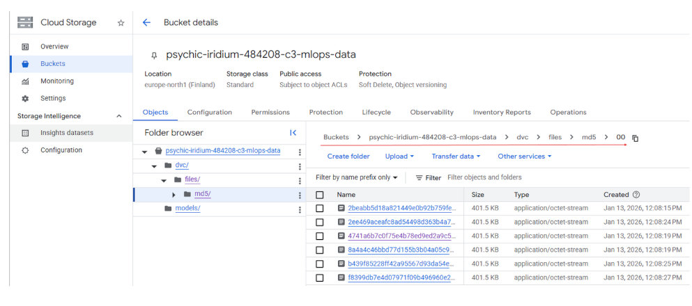 

**Question 20**

  **Upload 1-2 images of your GCP artifact registry, such that we can see the different docker images that you have**  
  
   
  Answer:

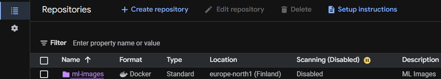   
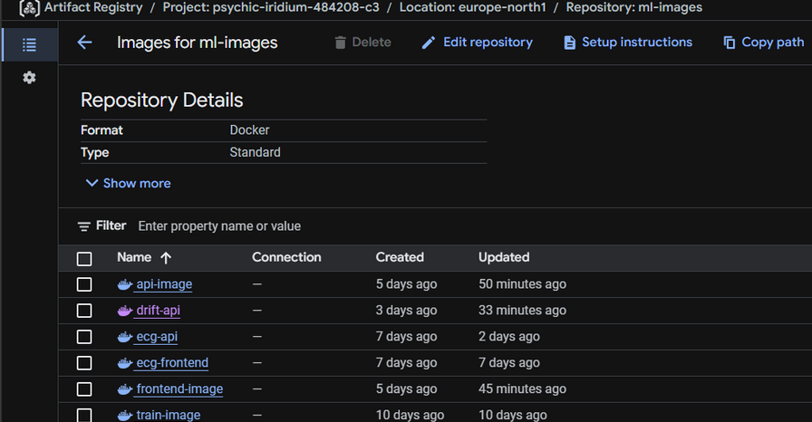

**Question 21**

  **Upload 1-2 images of your GCP cloud build history, so we can see the history of the images that have been build in**  
  **your project. **  
   
  Answer:

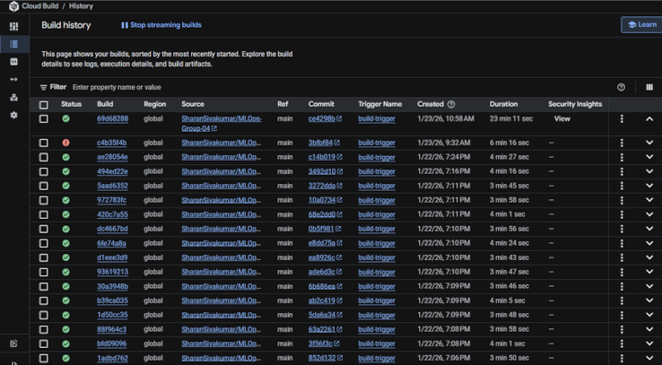  
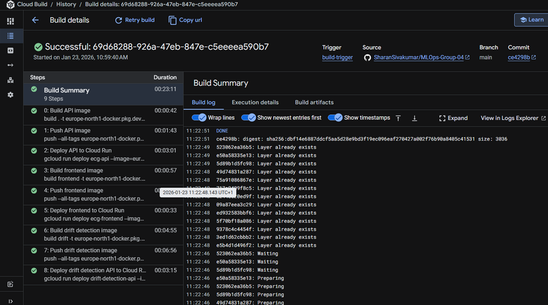

**Question 22**

  **Did you manage to train your model in the cloud using either the Engine or Vertex AI? If yes, explain how you did**  
  **it. If not, describe why.**  
   
  Recommended answer length: 100-200 words.  
   
  Answer:

Yes, we trained our model in the cloud using Google Cloud Vertex AI. We built a Docker training image containing all dependencies, the training script, and data retrieval logic using DVC. The image was pushed to Artifact Registry. We created a \`config.yaml\` file specifying the machine configuration e2-medium (2 vCPUs, 4 GB Memory), training arguments, and Docker image location. To trigger training, we used the gcloud CLI command to submit a custom job to Vertex AI. Vertex AI automatically provisioned the specified VM, pulled the Docker image, mounted the training data from Cloud Storage, and executed the training script with the specified hyperparameters. The trained model checkpoint was saved back to Cloud Storage.

## Deployment

**Question 23**

  **Did you manage to write an API for your model? If yes, explain how you did it and if you did anything special. If**  
  **not, explain how you would do it.**  
   
  Recommended answer length: 100-200 words.  
   
  Answer:

Yes. We implemented a lightweight inference API using FastAPI. On application startup we load the trained PyTorch Lightning model from a checkpoint; if the checkpoint is not present in the container, the service can download it from a Google Cloud Storage bucket using a MODEL\_GCS\_URI environment variable, which keeps the container small and allows updating the deployed model without rebuilding the image. 

The API exposes a simple GET endpoint for readiness (/) and a POST inference endpoint (/predict). The /predict endpoint accepts an uploaded .npy file, validates the file type and expected array shape (ECG images shaped to 224×224 with a single channel), converts the input to a Torch tensor, and runs inference in torch.no\_grad() mode on CPU or CUDA if available. The response returns the predicted class label (AF/Noise/NSR) along with class probabilities.

**Question 24**

  **Did you manage to deploy your API, either in locally or cloud? If not, describe why. If yes, describe how and**  
  **preferably how you invoke your deployed service?**  
   
  Recommended answer length: 100-200 words.  
   
  Answer:

\--- question 24 fill here \---

Locally, we ran the FastAPI app in a Docker container to make sure the image worked before deployment. In the cloud, we use Cloud Build to build the API image, push it to Artifact Registry, and then deploy it to Cloud Run (service name `production-api` in `europe-north1`). The same Cloud Build setup also deploys our Streamlit frontend as `production-frontend`. Once deployed, you call it over HTTP. The API has a simple `GET /` endpoint to check it’s up, and a `POST /predict` endpoint for inference. `/predict` expects a `.npy` file upload (multipart form data) and returns a JSON response with the predicted class and probabilities.

Example call using the public url

```bash
curl -X POST "https://ecg-frontend-579499894470.europe-north1.run.app/predict" -F "file=@example_ecg.npy"
```

**Question 25**

  **Did you perform any unit testing and load testing of your API? If yes, explain how you did it and what results for**  
  **the load testing did you get. If not, explain how you would do it.**  
   
  Recommended answer length: 100-200 words.  
   
  Example:  
  *For unit testing we used ... and for load testing we used ... . The results of the load testing showed that ...*  
  *before the service crashed.*  
   
  Answer:

We performed both quite extensive load and unit testing on our API. For unit testing we used the fastapi test client. The advantage of using the fastapi test client is that it allows for testing the api without opening a server or opening a port. In the unit tests we test the health of the api, making sure we get expected 200 status code. We test our prediction is returned in the correct format. We test that if an incorrect input shape and input file format is provided, the api returns the expected codes. 

We used locust to perform load testing on our API. We created a test which When we run Locust for 1 minute with 5 users against the deployed API, if the overall p95 response time stays below 1.2s and Locust reports no fatal failure and the test passes.

**Question 26**

  **Did you manage to implement monitoring of your deployed model? If yes, explain how it works. If not, explain how**  
  **monitoring would help the longevity of your application.**  
   
  Recommended answer length: 100-200 words.  
   
  Answer:

We implemented monitoring of the deployed model. We did it using evidently.

A data drift api was created, and can be run through cloud run. The way it works is that we create “fake” inputs of randomly generated tensors in the same shape as the input. These inputs are classified by the model, and if the probability of a dominant class is above a certain threshold, they are marked as belong to that class, if no dominant class is found, they are classified in the reporting as belonging to a new “other” class.

Using evidently , a report is produced, which shows the distribution of the training data, using a histogram, and a histogram of the classified randomly generated data we have created. A visual comparison of the two histograms allows for checking of data drift. 

## Overall discussion of project

  In the following section we would like you to think about the general structure of your project.

**Question 27**

  **How many credits did you end up using during the project and what service was most expensive? In general what do**  
  **you think about working in the cloud?**  
   
  Recommended answer length: 100-200 words.  
   
  Answer:

In the group project, we used 15$ in the cloud. The most expensive part was the purchase of the VM instance. We were very sensitive with our credits and always took the cheapest options available, also using a lightweight model. 

This had the disadvantage that training a model on the cloud using Vertex AI was significantly slower than running a model locally. In general we can see the strengths of the cloud, maybe clearer when you have money to spend.

Working in the cloud is both convenient and inconvenient, debuggin is harder and the cycle for updating builds is long and frustrating. However in general it is relatively user friendly, and hosting web apis was very straight forward.

\--- question 27 fill here \---

**Question 28**

  **Did you implement anything extra in your project that is not covered by other questions? Maybe you implemented**  
  **a frontend for your API, use extra version control features, a drift detection service, a kubernetes cluster etc.**  
  **If yes, explain what you did and why.**  
   
  Recommended answer length: 0-200 words.  
   
  Answer:

We implemented a small frontend using streamlit for our API. We did this because we wanted to display the information from our prediction in a pretty manner. Our frontend displays the probabilities of the different classes, helping display the uncertainty in the model, and makes our application intuitive and easy to use.
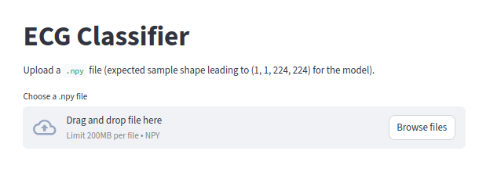
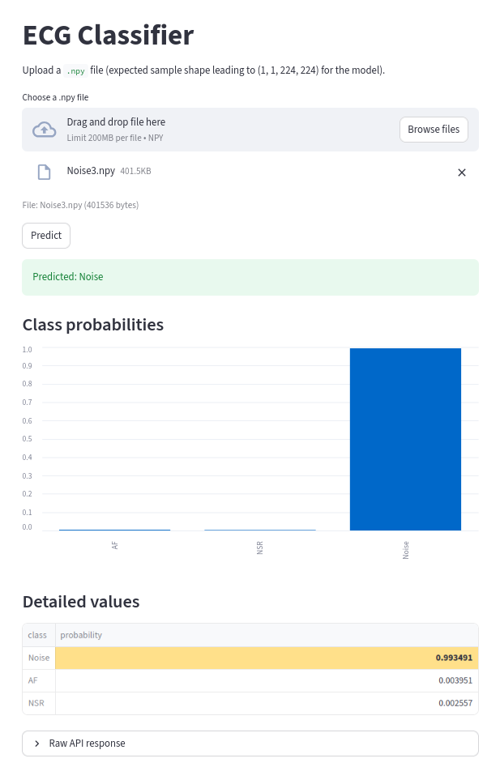

**Question 29**

  **Include a figure that describes the overall architecture of your system and what services that you make use of.**  
  **You can take inspiration from \[this figure\](figures/overview.png). Additionally, in your own words, explain the**  
  **overall steps in figure.**  
   
  Recommended answer length: 200-400 words  
   
  Answer:

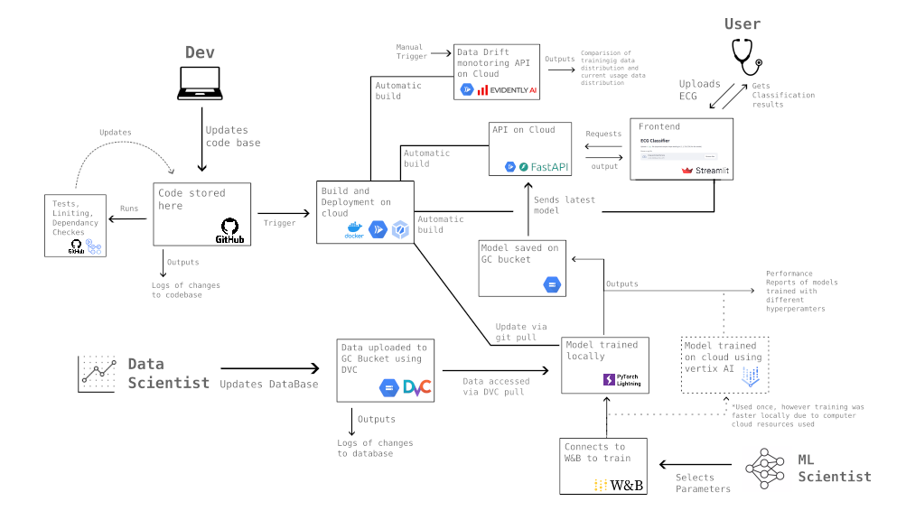

The starting point for our diagram is the developer. They update the code base locally, and push and commit, prior to committing, a pre commit is run. Changes to the main branch trigger github actions. The actions involve checking for dependency issues, linting, along with tests. 

Pushing to main also triggers automatic building and deployment of the codebase in the cloud. We create 4 docker images, a training image, an API image, a Frontend image and a monitoring (drift) image. Two of these are automatically built, the frontend and api docker images. None are automatically deployed to prevent incorrect code from being deployed. 

A Data scientist in charge of the data in the project would use DVC to add and commit changes to the database, which is stored on a google cloud bucket.

A Machine learning engineer would select parameters to train the model, then pull and build the updated docker image for training. They would then connect to Weights and Biases and run experiments there. Ideally we would prefer to do this on the cloud (as we tried) however the training time is much faster locally due to cost constraints. Once a good model is found, it is put in the model directory as the latest model.

The latest uploaded model to the model directory is used by our API, made using fast api. A front end built using streamlit communicates with the backend for intuitive use. 

A monitoring API keeps track of api requests…

**Question 30**

  **Discuss the overall struggles of the project. Where did you spend most time and what did you do to overcome these**  
  **challenges?**  
   
  Recommended answer length: 200-400 words.  
   
  Answer:

\--- question 30 fill here —

The main struggles in the project related to deploying on the cloud. We had big problems with debugging deployment issues, mainly due to the large lag between starting the deployment process and seeing the results. In particular we struggled with deploying the data drift. Many of the struggles here were due to issues that were not completely clear from the build logs. Here we used Gcloud's built-in “Investigate” feature, which resolved some of the issues. However, the main issues were resolved when running locally and reading from those logs. We successfully resolved all setbacks, and managed to deploy the data-drift implementation.

**Question 31**

  **State the individual contributions of each team member. This is required information from DTU, because we need to**  
  **make sure all members contributed actively to the project. Additionally, state if/how you have used generative AI**  
  **tools in your project.**  
   
  Recommended answer length: 50-300 words.  
   
  Answer:

\--- question 31 fill here \---

S250806 was tasked with writing the report, creating figures. He was in charge of the frontend, and did some initial work on the data loading and training files.

S242656 wrote some API tests and set up the cloudbuild so that we could deploy all of our services together for CI. Also worked on the system Integration King and conflict resolution on the repo.

S194077 took part in writing the report, filling out questions and adding screenshots. Contributed to the workflow files, and worked on the implementation for the data-drift monitoring. 

S194408 implemented the profiling, logging, and sweep experiment for the model. Additionally, he implemented the trigger for activating the image build on GCP for the model training and evaluation.

All members contributed to debugging, merging Dependabot pull-requests, and codereviews.

We have used ChatGPT to help debug our code. Additionally, we used GitHub Copilot to help write some of our code.


